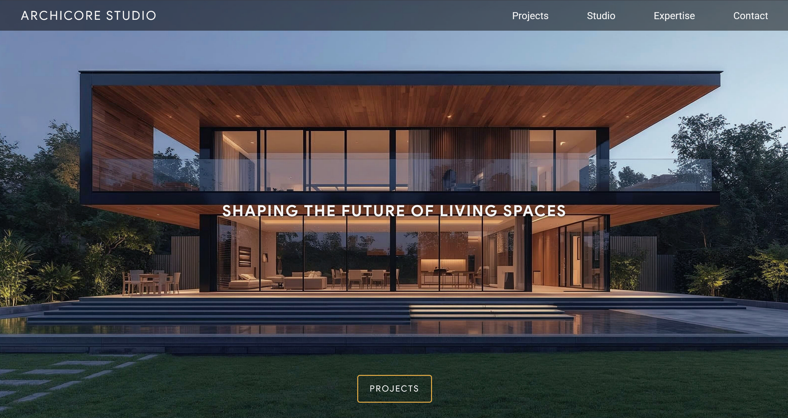
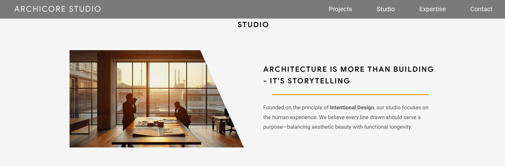
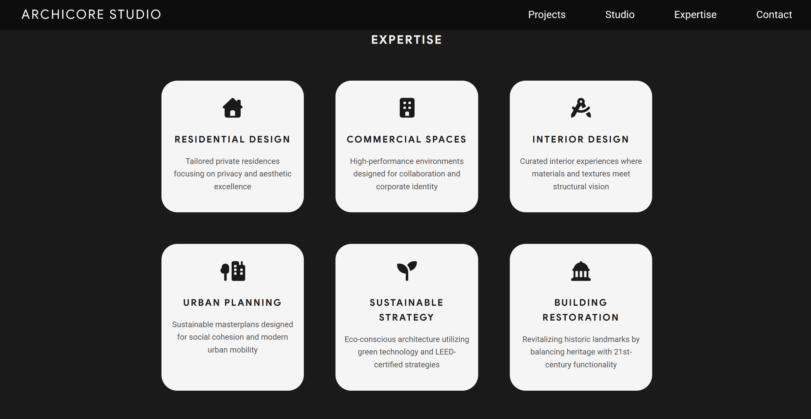
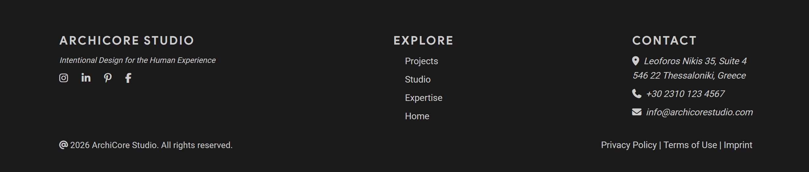

# ArchiCore Studio

> Professional AEC Portfolio & Engineering Interactive Tools
> [Source Code](https://github.com/abasiadimas/archicore-studio)

## Screenshots






## Table of Contents

- [General Information](#general-information)
- [Built With](#built-with)
- [Features](#features)
- [Getting Started](#getting-started)
- [Project Status](#project-status)
- [Authors](#authors)
- [Acknowledgements](#acknowledgements)

## General Information

- **ArchiCore Studio** serves as a digital bridge between **Civil Engineering** and **Software Engineering**, blending technical precision with modern web design.
- Beyond a portfolio, it functions as a **high-end architectural studio storefront**, featuring a minimalist aesthetic, professional branding, and a seamless user experience (UX).
- Designed as the central hub for my transition into a **Full-stack AEC Engineering** career, translating complex engineering logic into interactive, visually-integrated web applications.

## Built With

- **HTML5:** Semantic structure optimized for SEO and accessibility.
- **CSS3:** Advanced layouts utilizing CSS Grid and Flexbox for a modern UI.
- **JavaScript (Vanilla):** Dynamic functionality and DOM manipulation for interactive elements.

## Features

### Phase 1: Core Design & Static UI (Current)

_Focusing on the visual identity and structural foundation of the studio._

#### Web Interaction & UX

- **Architectural Branding:** A cohesive visual identity designed to reflect the precision and elegance of **modern architecture**.
- **Responsive Layout:** A clean, mobile-friendly structure built with **semantic HTML and Flexbox**.

### Phase 2: Interactive Logic & AEC Tools (Upcoming)

_Integrating JavaScript functionality and complex engineering tools (Work in Progress)._

#### Web Interaction & UX

- **Responsive Navigation:** A fully functional **Hamburger Menu** for optimized mobile user experience
- **Personalized Theme:** Integrated **Dark Mode** toggle for comfortable browsing.
- **Navigation Tools:** A **Scroll-to-top button** to improve navigation on long-form content pages.

#### AEC Engineering Tools

- **Greek Market Cost Estimator:** An interactive **construction cost calculator** based on current Greek market data for Thessaloniki.
- **Eco-Impact Estimator:** A tool to estimate the **environmental footprint (_CO2 emissions_)** based on material selection and square meters.
- **Weather Widget:** Real-time weather data for **Thessaloniki** to assist in on-site construction scheduling and planning.

## Getting Started

To explore the portfolio and use the AEC engineering tools locally, follow these steps:

- **Clone the repository:**

  ```bash
  git clone https://github.com/abasiadimas/archicore-studio.git
  ```

- **Navigate to the project directory:**

```bash
cd archicore-studio
```

- **How to view:**
  Simply open `index.html` in any modern web browser.

## Project Status

Project is: _**In Development** (Phase: JavaScript Integration & AEC Logic Implementation)._

## Version History

- **1.0:** Initial Static Release (HTML/CSS) - Baseline design of the portfolio structure.
- **2.0 (Current):** Version Control Implementation (Git/GitHub via SSH) and Project Architecture Setup.

## Authors

- **Anastasios Basiadimas** - _BSc Civil Engineer | ASc Computer Science._
- **Contact:** [GitHub Profile](https://github.com/abasiadimas) | [LinkedIn](https://www.linkedin.com/in/abasiadimas)

## Acknowledgements

- **AEC Community:** For providing the cost and material data specific to the Greek construction industry.
- **Canva AI:** Visual assets and project imagery were generated using _Canva’s Magic Media AI_ to create a unique architectural aesthetic.
